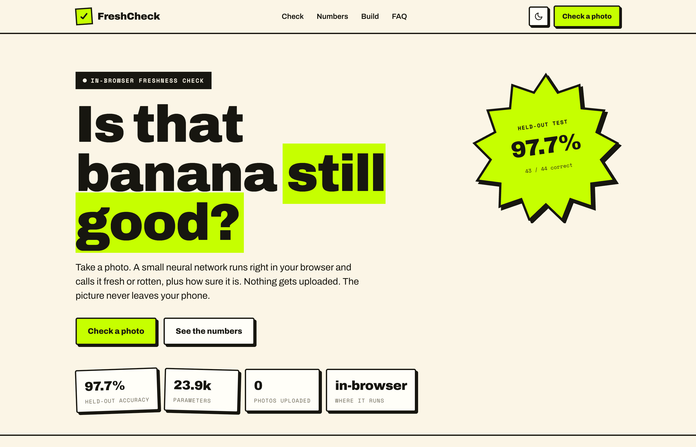
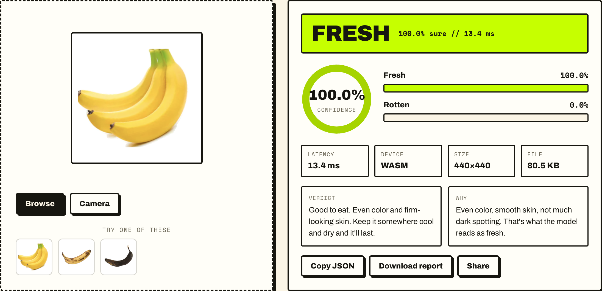

<div align="center">

<a href="https://freshcheckfruit.vercel.app/">
  
</a>

<h1>FreshCheck</h1>

**Snap a banana, get a fresh-or-rotten call in the browser. The photo never leaves your device.**

A ~24K-parameter CNN, trained in PyTorch, exported to ONNX, and run entirely client-side with WebAssembly.

[Live Demo](https://freshcheckfruit.vercel.app/) · [How It Works](#how-it-works) · [Honest Numbers](#honest-numbers) · [Run It](#run-it)

</div>

---

> [!NOTE]
> **In plain English, no code required.** Point your phone at a banana and FreshCheck tells you whether it is still good to eat, along with how sure it is. The part engineers care about: the AI model runs *inside the web page itself*, so your photo is never uploaded, there is no server to run or pay for, and the answer comes back instantly. I trained the model, caught and fixed a data problem that was faking a perfect score, then proved it on photos it had never seen and shipped it as a plain static site.

## See It Work

Drop in a photo (or use one of the built-in examples) and the model runs on the spot: a verdict, a confidence gauge, per-class probabilities, and latency, all computed client-side.

<div align="center">
  
</div>

## Highlights

- **In-browser inference, zero backend.** A PyTorch model exported to ONNX and run client-side with `onnxruntime-web` (WebAssembly). No upload, no server, no cold start. "Photos uploaded" is genuinely 0.
- **Honest evaluation over a vanity metric.** The source dataset's train and test folders were byte-for-byte duplicates, which had produced a fake "100% validation accuracy." I de-duplicate by content hash, group near-identical frames with a perceptual hash, and build a seeded, group-aware 70/15/15 split so no look-alike leaks across it. Results come with a Wilson confidence interval, not just one number.
- **Tiny on purpose.** `TinyFreshNet` is a ~24K-parameter CNN: trains in a few minutes on a laptop, a ~112 KB model file, ~14 ms per prediction.
- **Designed, not templated.** Hand-built HTML/CSS/vanilla JS UI: drag-and-drop and camera capture, confidence gauge, probability bars, a four-level verdict, batch mode, copy-JSON and downloadable report, shareable links, dark mode.

## Run It

The `web/` directory is a zero-build static site. To preview the deployed experience:

```bash
python export_onnx.py               # writes web/model.onnx + web/meta.json from the checkpoint
python -m http.server -d web 8000   # open http://localhost:8000
```

That is the whole demo. It loads only `onnxruntime-web` from a CDN plus two web fonts; everything else is inline, so there is no `npm install`.

<details>
<summary><b>Train It Yourself</b> (real banana data, no login)</summary>

The shipped model trains on real banana photos from the Hugging Face dataset [`nikibout/fresh-and-rotten-fruit`](https://huggingface.co/datasets/nikibout/fresh-and-rotten-fruit) (~120 MB, no auth).

```bash
pip install -r requirements.txt
python prepare_hf_banana.py         # downloads + lays out data/{train,val,test}/{fresh,rotten}
python train.py --data-dir data --epochs 40
python evaluate.py                  # writes metrics.json (held-out test accuracy)
python export_onnx.py               # refresh the ONNX asset for the web app
```

`train.py` applies inverse-frequency class weights and keeps the checkpoint with the best validation accuracy. The test split is never touched during training.

</details>

<details>
<summary><b>Other data sources and the optional server</b></summary>

**Kaggle multi-fruit.** Download [Fruits fresh and rotten for classification](https://www.kaggle.com/datasets/sriramr/fruits-fresh-and-rotten-for-classification), then:

```bash
python prepare_real_data.py --src /path/to/unzipped/dataset --dst data
python train.py --data-dir data --epochs 20
```

You can also drop your own photos into `data/{train,val,test}/{fresh,rotten}/`.

**Optional FastAPI server.** The deployed demo needs no backend, but `server.py` is included if you would rather run inference on a machine:

```bash
python server.py   # http://127.0.0.1:8000
```

Endpoints: `GET /api/meta` (architecture, params, dataset sizes, measured accuracy), `POST /api/predict` (image to class, confidence, probabilities, latency), `GET /api/examples`. There is also a minimal Gradio UI in `app.py`.

**Deploy to Vercel.** Import the repo, set **Root Directory = `web`**, framework preset **Other**, empty build command. Every push to `main` redeploys.

</details>

## Honest Numbers

Held-out test set, 44 images the model never saw during training:

| Metric | Value |
|---|---|
| Test accuracy | **97.7%** (43 / 44) |
| 95% Wilson CI | 88.2% to 99.6% |
| Parameters | 23,938 |
| Model file | ~112 KB (ONNX) |
| Inference | ~14 ms (WebAssembly) |

The set is small (n=44), so the interval is wide, and this is a number for *bananas*, not a promise about every fruit. The earlier "100% validation accuracy" came from exact-duplicate leakage across the old split and is gone. The real point of the project is the leak-free pipeline and the in-browser deployment, both of which carry over to bigger datasets.

> Banana-only because local disk was tight (~1.3 GB free) for the full ~9 GB multi-fruit set. To go multi-fruit, free up disk and use `Densu341/Fresh-rotten-fruit` on Hugging Face, or the Kaggle route above.

## How It Works

1. A photo is resized to 64x64 and normalized.
2. Three small conv blocks (`3→16→32→64`, each with BatchNorm, ReLU, MaxPool) pull out features; a global-average-pooled linear head outputs `fresh` vs `rotten` logits.
3. Training uses augmentation (flips, rotation, color jitter) so the tiny net generalizes. The best-validation checkpoint is saved to `checkpoints/freshnet.pt`.
4. At inference, logits go through softmax and the top class plus its confidence becomes one of four plain verdicts: fresh, still ok, going off, rotten.

## What's In The Repo

| File | What it does |
|---|---|
| `model.py` | The CNN (`TinyFreshNet`) |
| `data_utils.py` | Image transforms and dataset loaders |
| `train.py` | Train the model, save a checkpoint |
| `evaluate.py` | Honest train/val/test accuracy, write `metrics.json` |
| `inference.py` | Load the checkpoint, classify one image |
| `predict.py` | CLI: `python predict.py fruit.jpg` |
| `export_onnx.py` | Export the checkpoint to ONNX for the web app |
| `server.py` | Optional FastAPI inference server |
| `app.py` | Gradio web app (drag-and-drop upload) |
| `prepare_hf_banana.py` | Fetch and lay out the Hugging Face banana set |
| `prepare_real_data.py` | Convert the Kaggle multi-fruit dataset into this layout |
| `make_sample_data.py` | Synthetic data to test the pipeline end to end |
| `web/index.html` | The static, in-browser app |

## License

MIT. See [LICENSE](LICENSE).
